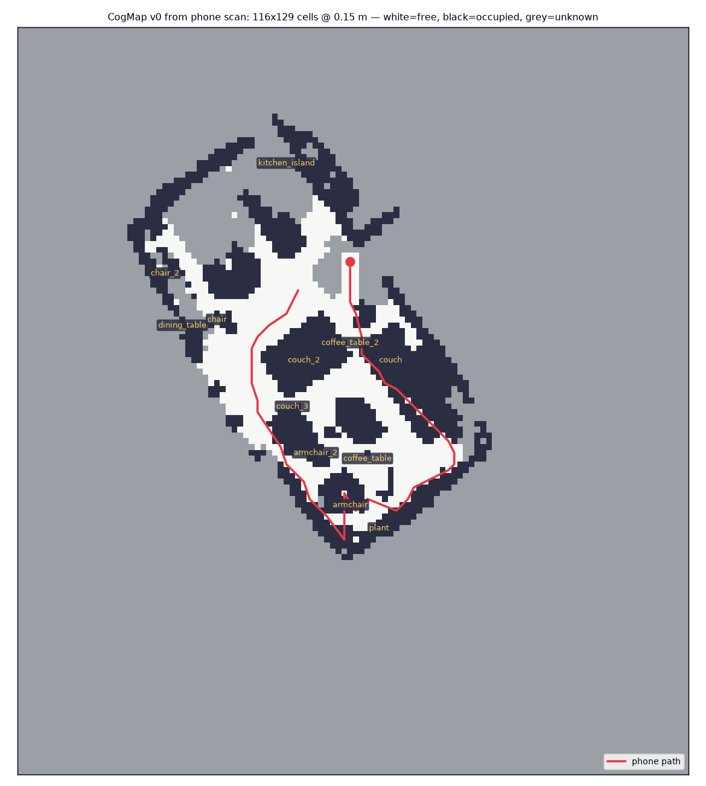
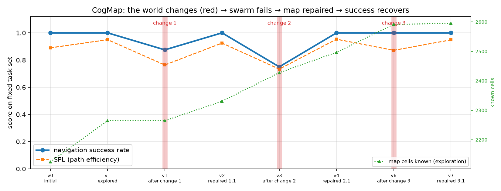
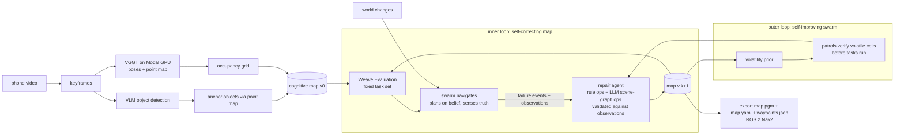
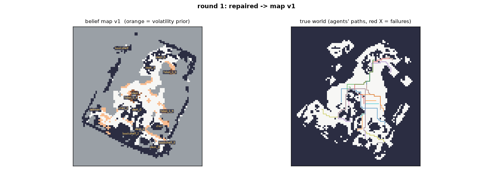
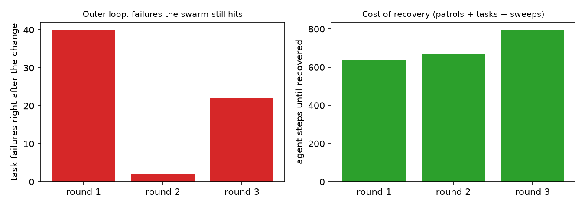
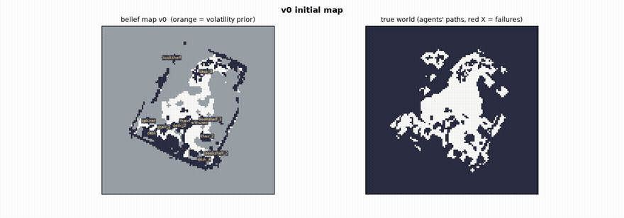

# CogMap — self-repairing cognitive maps for robots, from a phone walkthrough

> **CoreWeave Hacks 2026 (Agent Loops)** · Track: Best Use of Weave · eligible for Best Loop Design
> Weave project: https://wandb.ai/sissiwang-maglev/cogmap/weave

Walk through any space with your phone. **CogMap** turns the video into a cognitive map (a metric occupancy grid plus a
semantic object graph), lets a swarm of simulated robots learn to navigate it, and when the world changes — someone
moves the couch — the swarm's *failures* drive an automatic map repair so navigation success recovers. Across repeated
changes the swarm learns *where* the world tends to change and heals faster. The map is exported as the exact artifact a
Nav2 robot (Unitree Go2/G1 stacks) loads today.

<p align="center"> </p>
<p align="center"><sub>Left: cognitive map v0 built from an 18-second phone clip of a living room (VGGT point map → occupancy grid, VLM-labelled furniture anchored through the point map, phone path in red). Right: the loop on a real office scan — every red band is a world change, every recovery is a new map version evaluated in Weave; the green line is the map growing as scouts explore between changes; change 3 was caught by a patrol before any task failed.</sub></p>

## The loops (what makes it self-improving)



1. **Inner loop — self-correcting map.** Agents plan A\* on the *belief* map and execute in the *true* world with a local
   sensor. Every expectation≠observation is a `FailureEvent`. The repair agent turns pooled failures + observations into a
   new map version: deterministic ops (consensus cell flips, orphaned-object removal, new obstacle blobs, object
   re-identification) and LLM-proposed scene-graph ops (`relocate / remove / add / rename`) that are validated against the
   observations before they are applied. Each map version is a `weave.Evaluation` on a fixed task set, so the recovery is a
   curve, not a claim.
2. **Outer loop — self-improving swarm.** Each repair updates a per-cell **volatility prior**. Before tasks run, patrol
   agents verify high-volatility / low-confidence cells, so the *next* change is caught before any task fails
   (round 3 in the synthetic demo: a stale obstacle is discovered and removed pre-emptively, success stays at 100%).
   A search sweep is dispatched when a goal object goes missing, and the moved object is re-identified from its footprint.
3. **Exploration — the map grows with use.** Before each round, scouts push into the frontier (known-free cells next to
   unknown ones); whatever they observe is merged into the map, so the number of known cells rises version after version
   (the green dotted line on the curves). The phone only ever saw part of the floor; the swarm fills in the rest.
4. Every function is a `@weave.op`; every map version is a Weave Evaluation named `map_v{k}`; a Weave Leaderboard ranks map
   versions.

**The team, as it appears in the Weave traces:** `navigator_swarm` (task robots), `scout_patrol` / `scout_search_sweep`
(verification and search agents driven by the volatility prior), `cartographer_rule_repair` (deterministic map surgery),
`reasoner_propose_ops` (LLM scene-graph reasoning), `verifier_apply_ops` (evidence gate; rejects unsupported edits),
`reflector_changelog` / `reflector_llm_postmortem` (human-readable memory of what changed and why).


## Results (synthetic apartment, 16 fixed tasks, 4 scripted world changes, LLM repair + patrols on)

| map version / event | success | SPL | collisions | what happened |
|---|---|---|---|---|
| v0-initial | 100% | 1.00 | 0 | Initial cognitive map from the scan. |
| v0-after-change-1 | 100% | 0.95 | 12 | Someone dragged the coffee table into the living-room/bedroom doorway. |
| v1-repaired-1.1 | 100% | 1.00 | 0 | Someone dragged the coffee table into the living-room/bedroom doorway. |
| v1-after-change-2 | 75% | 0.75 | 0 | The couch was moved from the living room into the hallway. |
| v2-repaired-2.1 | 100% | 1.00 | 0 | The couch was moved from the living room into the hallway. |
| v3-after-change-3 | 100% | 1.00 | 0 | The coffee table went back to the living room: the doorway is open aga |
| v3-after-change-4 | 81% | 0.79 | 5 | A laundry basket now blocks the bedroom/hallway doorway. |
| v4-repaired-4.1 | 94% | 0.94 | 0 | A laundry basket now blocks the bedroom/hallway doorway. |

| round | repairs | steps to recover | final success |
|---|---|---|---|
| 1 | 1 | 681 | 100% |
| 2 | 1 | 902 | 100% |
| 3 | 0 | 574 | 100% |
| 4 | 1 | 860 | 94% |

Round 3 is the outer loop at work: the volatility prior sent a patrol to the doorway that had changed before, it saw the
stale obstacle was gone, and the map was repaired **before any task failed** (0 repairs, success stayed 100%).
Real-scan results (luxury living room clip, TUM office sequence) are in `out/lux/` and `out/tum/` and on the Weave
leaderboard; see below.


### Real scans (12 reachability-checked tasks each, auto-generated world changes)

**Living room, 18-second phone clip** (`out/lux`, 116×129 cells @ 0.15 m, 12 VLM-labelled objects):

| map version / event | success | SPL | collisions | what happened |
|---|---|---|---|---|
| v0-initial | 100% | 0.93 | 0 | Initial cognitive map from the scan. |
| v0-after-change-1 | 88% | 0.79 | 14 | The armchair was dragged into the busiest corridor (chokepoint at (64, 64)). |
| v1-repaired-1.1 | 88% | 0.82 | 0 | The armchair was dragged into the busiest corridor (chokepoint at (64, 64)). |
| v2-repaired-1.2 | 88% | 0.82 | 0 | The armchair was dragged into the busiest corridor (chokepoint at (64, 64)). |
| v2-after-change-2 | 69% | 0.65 | 0 | The plant (goal of 3 tasks) was moved across the room to (38, 27). |
| v3-repaired-2.1 | 75% | 0.75 | 0 | The plant (goal of 3 tasks) was moved across the room to (38, 27). |
| v5-repaired-2.2 | 94% | 0.90 | 0 | The plant (goal of 3 tasks) was moved across the room to (38, 27). |
| v5-after-change-3 | 94% | 0.93 | 0 | The armchair was put back: the corridor is open again but the map still thinks i |

**Office, TUM RGB-D `freiburg1_room` sequence** (`out/tum`, 112×109 cells, desks/bookshelves/chairs):

| map version / event | success | SPL | collisions | what happened |
|---|---|---|---|---|
| v0-initial | 100% | 0.91 | 0 | Initial cognitive map from the scan. |
| v0-after-change-1 | 75% | 0.65 | 21 | The desk was dragged into the busiest corridor (chokepoint at (53, 53)). |
| v1-repaired-1.1 | 100% | 0.89 | 0 | The desk was dragged into the busiest corridor (chokepoint at (53, 53)). |
| v2-after-change-2 | 94% | 0.88 | 1 | The desk_5 (goal of 3 tasks) was moved across the room to (61, 34). |
| v3-repaired-2.1 | 94% | 0.88 | 0 | The desk_5 (goal of 3 tasks) was moved across the room to (61, 34). |
| v4-after-change-3 | 94% | 0.88 | 0 | The desk was put back: the corridor is open again but the map still thinks it is |

<p align="center"><br><sub>Office scan after the first repair: belief map (left, labels = object graph, orange = volatility prior) vs. the simulated true world with the swarm's paths and the collision that triggered the repair (right). Grey = never seen by the phone.</sub></p>

In the office run, rounds 2 and 3 were caught by the patrols (the outer loop): the volatility prior sent verification agents
to the cells that changed before, they saw the difference, and the map was repaired *before* the task swarm ran.

<p align="center"> </p>


### Ablation on the real office scan: what the outer loops buy

Cells read `success / collisions right after the change → success after repair`. Same scan, same 12 tasks, same three changes.

| variant | round 1 | round 2 | round 3 | final map | known cells v0 → end |
|---|---|---|---|---|---|
| full loop (patrols + exploration + LLM repair) | 88%/24c → 100% in 1 repair | 75%/9c → 100% in 1 repair | 100%/7c (patrol caught it) → 100% in 1 repair | v8 | 2125 → 2595 |
| rule repair only (no patrols, no exploration, no LLM) | 81%/35c → 100% in 1 repair | 75%/6c → 100% in 1 repair | 88%/18c → 100% in 1 repair | v3 | 2125 → 2384 |

Same recovery power in both (the deterministic repair is the workhorse), but with patrols + exploration the third change is
caught **before the task swarm runs** (100% instead of 88%, 7 instead of 18 collisions), and the map ends with 22% more
known cells than the scan started with (2125 → 2595) because scouts kept pushing the frontier between changes.

### Ablation (synthetic apartment): what each part of the loop buys

Cells are `final success / repairs needed / agent steps to recover`.

| variant | round 1 (door blocked) | round 2 (couch moved) | round 3 (stale obstacle) | round 4 (door blocked) |
|---|---|---|---|---|
| rule repair only, no patrols | 100% / 1 / 681 | 100% / 1 / 868 | 100% / 1 / 519 | 94% / 1 / 737 |
| rule + LLM repair, patrols on | 100% / 1 / 681 | 100% / 1 / 902 | 100% / 0 / 574 | 94% / 1 / 860 |

**Honest note on the LLM:** the deterministic Cartographer explained every failure in these runs, so the Reasoner's
scene-graph proposals were either empty or rejected by the Verifier (0 applied, 1 rejected across the office and synthetic
runs). The loop does not depend on an LLM to self-correct; the LLM's measurable contribution here is the post-mortem memory
(`map_changelog.md`) and the object labels from the scan. The outer loop shows in round 3: with patrols, the stale obstacle
is removed before any task runs (0 repairs, 574 steps vs 519 steps for a full task run + repair without patrols).

<p align="center"><br><sub>The loop on the TUM office scan, one command: v0 → desk dragged into the corridor (red X = collisions) → repaired → later changes caught by patrols (orange path).</sub></p>

## What you see in the demo

| stage | artifact |
|---|---|
| phone walkthrough → world model | `out/<run>/scan/scan_overview.png`, `pointcloud.html`, `contact_sheet.jpg` |
| swarm navigating, failing, map repaired | `out/<run>/swarm.mp4`, `snapshot_*.png` |
| success recovering per map version | `out/<run>/curve.png` + Weave Evaluations compare view / leaderboard |
| steps-to-recover per change | `out/<run>/steps_to_recover.png` |
| human-readable changelog | `out/<run>/map_changelog.md` |
| robot artifact | `out/<run>/scan/nav2/map.pgm`, `map.yaml`, `waypoints.json` |
| dashboard | `marimo run dashboard.py` |

## Run it

```bash
uv venv .venv --python 3.12 && source .venv/bin/activate
uv pip install -r requirements.txt
echo "WANDB_API_KEY=..." > .env            # Weave
export OPENAI_API_KEY=...                 # repair agent + VLM detector (Anthropic also supported: ANTHROPIC_API_KEY)
modal setup                               # once; then deploy the GPU reconstruction app
python -m modal deploy cogmap/scan/vggt_modal.py

python run_demo.py --synthetic            # synthetic apartment, 4 scripted world changes (~2 min)
python run_demo.py --synthetic --no-llm --no-patrols --out out/ablation   # ablation flags
python run_demo.py --video footage/raw/scan.mov   # real phone walkthrough (~5 min: VGGT ~1 min on an A10G, VLM ~1.5 min)
marimo run dashboard.py                   # results dashboard
python -m pytest tests -q
```

`run_demo.py` writes everything to `out/<name>/` and prints the Weave leaderboard ref.

## Architecture

```
cogmap/
  world.py      TrueWorld (ground truth), BeliefMap (grid + confidence + object graph + volatility + changelog), perturbations
  agents.py     A*, NavAgent (mission budget 1.5x optimal, 3x3 sensor, FailureEvents), Swarm, patrol sweeps
  repair.py     rule_repair, llm_propose_ops (Claude/OpenAI) + validate_and_apply_ops, patrol_targets, search_targets, reflect
  evals.py      MapNavModel(weave.Model), scorers success/spl/collisions/failures, evaluate_map, publish_leaderboard
  loop.py       CogMapLoop: patrol -> eval -> swarm -> search -> repair -> re-eval, per world change
  viz.py        curve, snapshots, swarm.mp4, scan_overview, pointcloud.html
  scan/
    frames.py       ffmpeg keyframes
    vggt_modal.py   Modal app: VGGT-1B on an A10G (poses, depth, point maps) — ~6 s GPU inference for 48 frames
    grid.py         floor-plane fit, scale normalisation, occupancy grid, cropping
    objects.py      VLM detection per keyframe -> point-map anchoring -> cross-frame merge -> footprints
    export_nav2.py  map.pgm + map.yaml + waypoints.json
    pipeline.py     scan_to_world(), auto_perturbations() for arbitrary scanned spaces
run_demo.py     CLI · dashboard.py  marimo · tests/  pytest
```

## Sponsor tools

- **W&B Weave** — `weave.init("cogmap")`; `@weave.op` on every agent step (swarm runs, patrols, rule repair, LLM proposals,
  validation, scan stages); `weave.Evaluation` per map version with custom scorers (success, SPL, collisions, failures);
  `weave.publish` of a `Leaderboard` over map versions and of the run's images (curve, scan overview, snapshots) as Weave
  objects; every evaluation's trace URL is written into `loop_result.json`; the Weave MCP server is registered in Claude
  Code so the coding agent could inspect traces while building.
- **Modal** — GPU reconstruction (VGGT-1B on A10G) as a deployed app with a warm container.
- **marimo** — `dashboard.py` results dashboard.
- **OpenAI / Anthropic** — repair agent (`gpt-5` with JSON output; Claude when `ANTHROPIC_API_KEY` is valid) and VLM detector.

## Honest limitations

- The scan's scale is up to a global factor (VGGT is scale-free); we normalise by assuming the phone is ~1.4 m above the
  floor. Nav2 will still relocalise with live LiDAR — our map is the prior, which is exactly why "repair after objects move"
  matters on real robots.
- Simulated agents see a deterministic 3×3 sensor; real perception is noisier. The consensus threshold `k` in
  `rule_repair` is the knob for that.
- Unknown cells (never seen by the phone) are treated as blocked in the true world and as high-cost in the belief.
- We claim Nav2-compatibility of the exported artifact, not that Unitree's proprietary app ingests it.

## Prior work we build on

VGGT (Wang et al., CVPR 2025), ConceptGraphs / VLMaps (open-vocabulary semantic maps), GraphPad and the
multi-modal 3D scene-graph updater (LLM scene-graph edits from observations), frontier exploration (Yamauchi 1997),
Reflexion-style verbal memory, Nav2 `map_server`.
