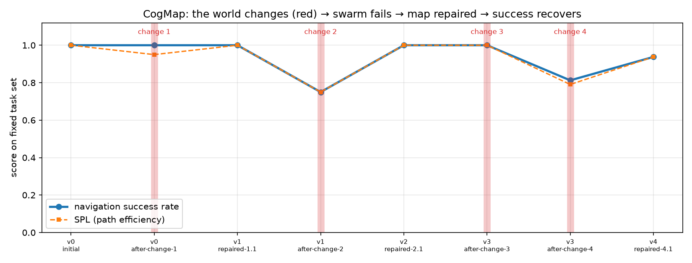
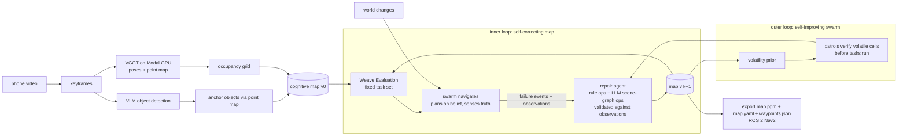

# CogMap — self-repairing cognitive maps for robots, from a phone walkthrough

> **CoreWeave Hacks 2026 (Agent Loops)** · Track: Best Use of Weave · eligible for Best Loop Design
> Weave project: https://wandb.ai/sissiwang-maglev/cogmap/weave

Walk through any space with your phone. **CogMap** turns the video into a cognitive map (a metric occupancy grid plus a
semantic object graph), lets a swarm of simulated robots learn to navigate it, and when the world changes — someone
moves the couch — the swarm's *failures* drive an automatic map repair so navigation success recovers. Across repeated
changes the swarm learns *where* the world tends to change and heals faster. The map is exported as the exact artifact a
Nav2 robot (Unitree Go2/G1 stacks) loads today.

<p align="center"> </p>

## The loops (what makes it self-improving)



1. **Inner loop — self-correcting map.** Agents plan A\* on the *belief* map and execute in the *true* world with a local
   sensor. Every expectation≠observation is a `FailureEvent`. The repair agent turns pooled failures + observations into a
   new map version: deterministic ops (consensus cell flips, orphaned-object removal, new obstacle blobs, object
   re-identification) and LLM-proposed scene-graph ops (`relocate / remove / add / rename`) that are validated against the
   observations before they are applied. Each map version is a `weave.Evaluation` on a fixed task set, so the recovery is a
   curve, not a claim.
2. **Outer loop — self-improving swarm.** Each repair updates a per-cell **volatility prior**. Before tasks run, patrol
   agents verify high-volatility / low-confidence cells, so the *next* change is caught before any task fails
   (round 3 in the synthetic demo: a stale obstacle is discovered and removed pre-emptively, success stays at 100%).
   A search sweep is dispatched when a goal object goes missing, and the moved object is re-identified from its footprint.
3. Every function is a `@weave.op`; every map version is a Weave Evaluation named `map_v{k}`; a Weave Leaderboard ranks map
   versions.


## Results (synthetic apartment, 16 fixed tasks, 4 scripted world changes, LLM repair + patrols on)

| map version / event | success | SPL | collisions | what happened |
|---|---|---|---|---|
| v0-initial | 100% | 1.00 | 0 | Initial cognitive map from the scan. |
| v0-after-change-1 | 100% | 0.95 | 12 | Someone dragged the coffee table into the living-room/bedroom doorway. |
| v1-repaired-1.1 | 100% | 1.00 | 0 | Someone dragged the coffee table into the living-room/bedroom doorway. |
| v1-after-change-2 | 75% | 0.75 | 0 | The couch was moved from the living room into the hallway. |
| v2-repaired-2.1 | 100% | 1.00 | 0 | The couch was moved from the living room into the hallway. |
| v3-after-change-3 | 100% | 1.00 | 0 | The coffee table went back to the living room: the doorway is open aga |
| v3-after-change-4 | 81% | 0.79 | 5 | A laundry basket now blocks the bedroom/hallway doorway. |
| v4-repaired-4.1 | 94% | 0.94 | 0 | A laundry basket now blocks the bedroom/hallway doorway. |

| round | repairs | steps to recover | final success |
|---|---|---|---|
| 1 | 1 | 681 | 100% |
| 2 | 1 | 902 | 100% |
| 3 | 0 | 574 | 100% |
| 4 | 1 | 860 | 94% |

Round 3 is the outer loop at work: the volatility prior sent a patrol to the doorway that had changed before, it saw the
stale obstacle was gone, and the map was repaired **before any task failed** (0 repairs, success stayed 100%).
Real-scan results (luxury living room clip, TUM office sequence) are in `out/lux/` and `out/tum/` and on the Weave
leaderboard; see below.

## What you see in the demo

| stage | artifact |
|---|---|
| phone walkthrough → world model | `out/<run>/scan/scan_overview.png`, `pointcloud.html`, `contact_sheet.jpg` |
| swarm navigating, failing, map repaired | `out/<run>/swarm.mp4`, `snapshot_*.png` |
| success recovering per map version | `out/<run>/curve.png` + Weave Evaluations compare view / leaderboard |
| steps-to-recover per change | `out/<run>/steps_to_recover.png` |
| human-readable changelog | `out/<run>/map_changelog.md` |
| robot artifact | `out/<run>/scan/nav2/map.pgm`, `map.yaml`, `waypoints.json` |
| dashboard | `marimo run dashboard.py` |

## Run it

```bash
uv venv .venv --python 3.12 && source .venv/bin/activate
uv pip install -r requirements.txt
echo "WANDB_API_KEY=..." > .env            # Weave
export OPENAI_API_KEY=...                 # repair agent + VLM detector (Anthropic also supported: ANTHROPIC_API_KEY)
modal setup                               # once; then deploy the GPU reconstruction app
python -m modal deploy cogmap/scan/vggt_modal.py

python run_demo.py --synthetic            # synthetic apartment, 4 scripted world changes (~2 min)
python run_demo.py --video footage/raw/scan.mov   # real phone walkthrough (~5 min: VGGT ~1 min on an A10G, VLM ~1.5 min)
marimo run dashboard.py                   # results dashboard
python -m pytest tests -q
```

`run_demo.py` writes everything to `out/<name>/` and prints the Weave leaderboard ref.

## Architecture

```
cogmap/
  world.py      TrueWorld (ground truth), BeliefMap (grid + confidence + object graph + volatility + changelog), perturbations
  agents.py     A*, NavAgent (mission budget 1.5x optimal, 3x3 sensor, FailureEvents), Swarm, patrol sweeps
  repair.py     rule_repair, llm_propose_ops (Claude/OpenAI) + validate_and_apply_ops, patrol_targets, search_targets, reflect
  evals.py      MapNavModel(weave.Model), scorers success/spl/collisions/failures, evaluate_map, publish_leaderboard
  loop.py       CogMapLoop: patrol -> eval -> swarm -> search -> repair -> re-eval, per world change
  viz.py        curve, snapshots, swarm.mp4, scan_overview, pointcloud.html
  scan/
    frames.py       ffmpeg keyframes
    vggt_modal.py   Modal app: VGGT-1B on an A10G (poses, depth, point maps) — ~6 s GPU inference for 48 frames
    grid.py         floor-plane fit, scale normalisation, occupancy grid, cropping
    objects.py      VLM detection per keyframe -> point-map anchoring -> cross-frame merge -> footprints
    export_nav2.py  map.pgm + map.yaml + waypoints.json
    pipeline.py     scan_to_world(), auto_perturbations() for arbitrary scanned spaces
run_demo.py     CLI · dashboard.py  marimo · tests/  pytest
```

## Sponsor tools

- **W&B Weave** — `weave.init("cogmap")`; `@weave.op` on every agent step (swarm runs, patrols, rule repair, LLM proposals,
  validation, scan stages); `weave.Evaluation` per map version with custom scorers; `weave.publish` of a `Leaderboard`;
  the Weave MCP server is registered in Claude Code so the coding agent could inspect traces while building.
- **Modal** — GPU reconstruction (VGGT-1B on A10G) as a deployed app with a warm container.
- **marimo** — `dashboard.py` results dashboard.
- **OpenAI / Anthropic** — repair agent (`gpt-5` with JSON output; Claude when `ANTHROPIC_API_KEY` is valid) and VLM detector.

## Honest limitations

- The scan's scale is up to a global factor (VGGT is scale-free); we normalise by assuming the phone is ~1.4 m above the
  floor. Nav2 will still relocalise with live LiDAR — our map is the prior, which is exactly why "repair after objects move"
  matters on real robots.
- Simulated agents see a deterministic 3×3 sensor; real perception is noisier. The consensus threshold `k` in
  `rule_repair` is the knob for that.
- Unknown cells (never seen by the phone) are treated as blocked in the true world and as high-cost in the belief.
- We claim Nav2-compatibility of the exported artifact, not that Unitree's proprietary app ingests it.

## Prior work we build on

VGGT (Wang et al., CVPR 2025), ConceptGraphs / VLMaps (open-vocabulary semantic maps), GraphPad and the
multi-modal 3D scene-graph updater (LLM scene-graph edits from observations), frontier exploration (Yamauchi 1997),
Reflexion-style verbal memory, Nav2 `map_server`.
